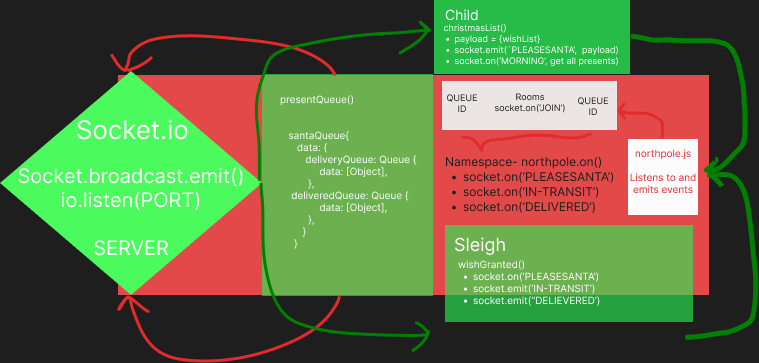

# Northpole Delivery Service

## Overview

A real-time modern service that allows children to request christmas presents from Santa Claus. The notification is sent to Santa so that he can immediately see what is in his pickup queue. He deciphers whether each child is naughty or nice and delivers gifts appropriately (whether it be cole or an actual present). Upon each visit, the child will be notified of their gift's delivery.

## UML

## Author

Seth Pierce and Megan Seibert-Hughes

## License

MIT License

### Setup

#### env variables

PORT

## How to initalize application

node index.js on each of the index.js files

## Features / Routes

/northpole namespace
